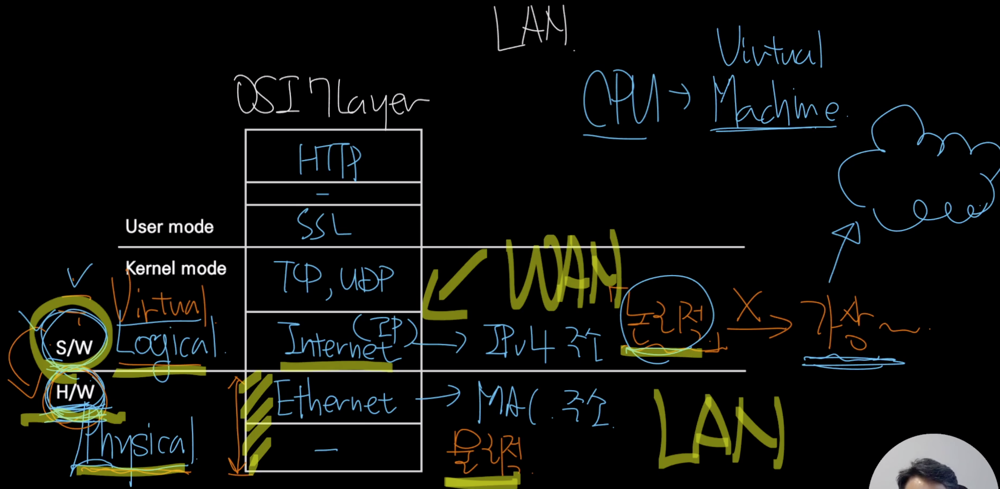
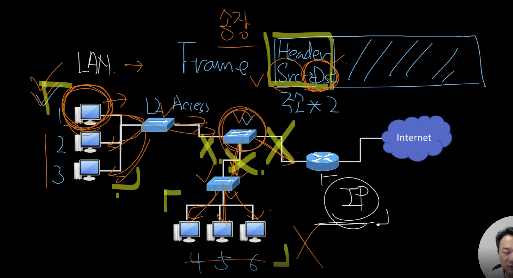
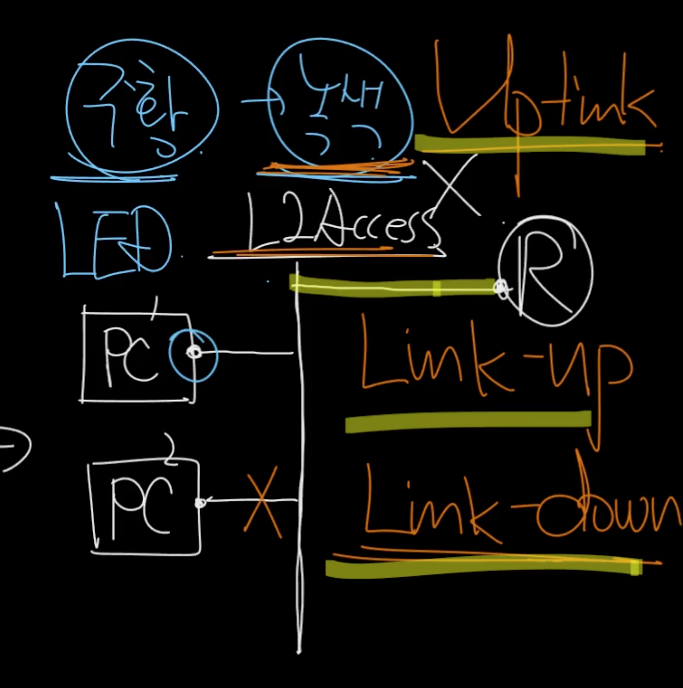
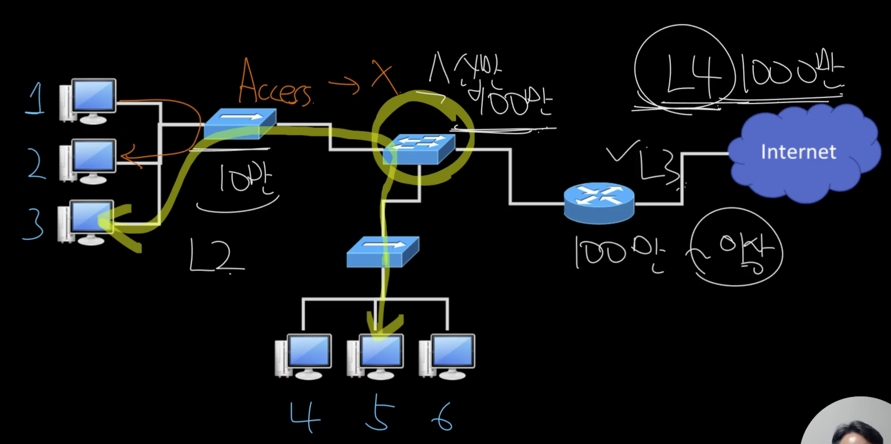
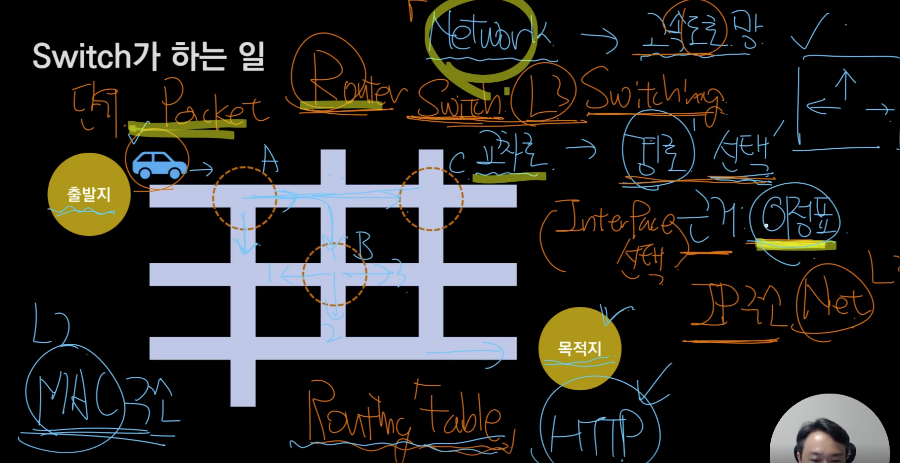
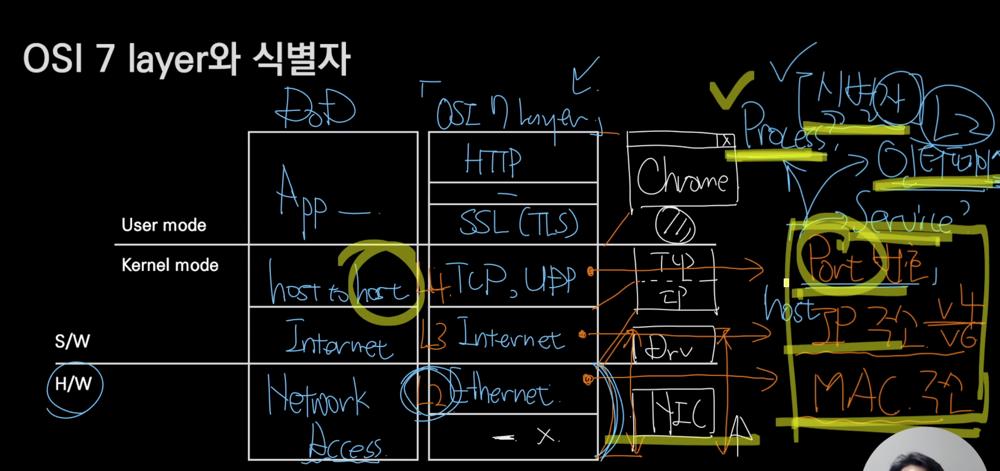

## 섹션 1  : Internet 기반 네트워크 입문 

### OSI 7 Layer와 식별자 

- 식별자 
	- L2 : MAC 주소 
		- NIC 카드를 식별함 
	- L3 : IP주소 
		- 호스트 식별(컴퓨터)
	- L4 : 포트 
		- 인터페이스 식별자? (공유기 포트들?) 
		- 서비스 ? (웹 서비스) 
		- 프로세스?  

### Host 
- 컴퓨터 + 네트워크 -> 컴퓨터는 Host가 되어버림
- 두개로 나뉜다 
	- End - Point 
		- 네트워크 이용주체 : 단말기 
		- 클라이언트, 서버, Peer(P2P)
	- Switch 
		- 네트워크 그 자체를 이루는 Host (인프라)
		- 라우터(L3), IPS, Tab ...  

### Switch가 하는 일 

- 네트워크를 고속도로망이라고 가정해보자.
- 출발지 -> 목적지로 간다면 항상 경로를 선택하게 됨.  
	- 어디로 가야할까?
	- 선택에는 근거가 있어야 함 -> 지도봄 -> 없으면..? -> 이정표 
- 교차로 = 스위치 
	- Interface(경로)를 선택 -> Switching 
		- IP주소를 근거로 -> L3 Switching 
		- Mac주소 -> L2 Switching 
		- Port -> L4 Switching 
		- HTTP  -> L7 Switching 
- 자동차 = 패킷(단위)
- L3 스위치는 라우터
	- 라우팅 테이블 (이정표)

### 항상 고민해야 할 주제는 비용 
- 출발지 -> 목적지로 갈때 여러 경로가 있다. 
	- 각각마다 비용이 다름 
- 비용 = Matric 값 

## 섹션 2 : L2 수준에서 외울 것들 

### NIC  + (L2) Frame + LAN card + MAC
- NIC = (흔히)LAN 카드 
	- 유/무선 굳이 구분하지 않음 
	- 하드웨어며 MAC주소를 가진다 
	- 여러 NIC를 가질 수 있음
- WAN, MAN, LAN - 네트워크 규모 
	- 공유기 + TV + PC => 하나의 LAN
- L2 **Frame**
	- 데이터 단위
	- 1Gbps - bit 

### L2 Access switch 

- End-point와 직접 연결되는 스위치 (L2)
	- Link-up = 물리적으로 연결 
	- Link-down  = 물리적으로 연결 안됨
	- 라우터와 연결된 선 = Uplink
- MAC주소를 근거로 스위칭

### L2 Distribution switch 

- L2 Access 스위치를 위한 스위치 
	- VLAN(Virtual LAN) 기능을 제공하는 것이 일반적

### LAN과 WAN의 경계 그리고 Broadcast 

- Broadcast <-> Unicast 
	- 효율이 떨어진다 
		- 브로드캐스트가 끝날때까지 통신을 못함?
	- 범위를 생각해보자
- Broadcast 주소라는 특별한 주소가 존재 (MAC, IP 모두 존재)
	- MAC(48 bit) : 모두 1 (FF-FF-FF-FF-FF-FF)
		- 전부 다 받아라~
- Frame의 헤더에는 출발지, 목적지의 MAC 주소가 있음

- 논리적인지 아니면 물리적인지로 구분하는 것도 방법 
	- 논리적 = Virtual, 가상 
	- 하드웨어(Physical)를 소프트웨어(Virtual)로 구현할 순 없나? -> 가능 
		- CPU => Virtual Machine
- Physical쪽이 LAN(정확 X)
	- Internet - WAN => 논리적인 네트워크 