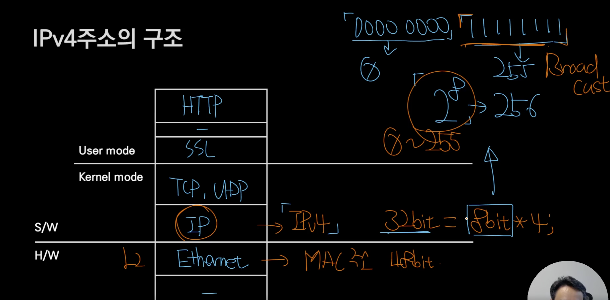
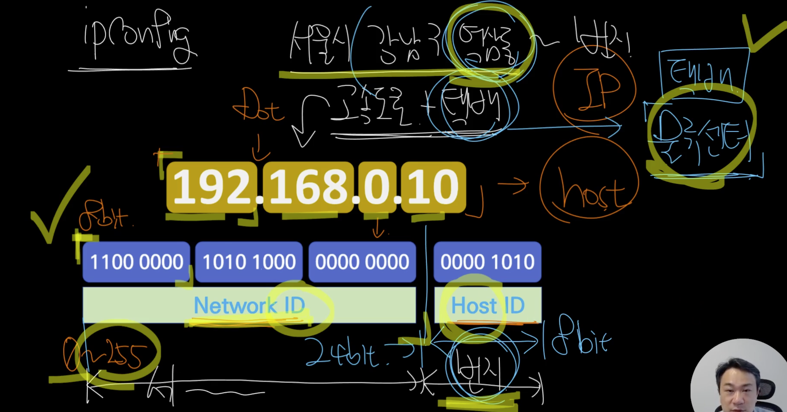
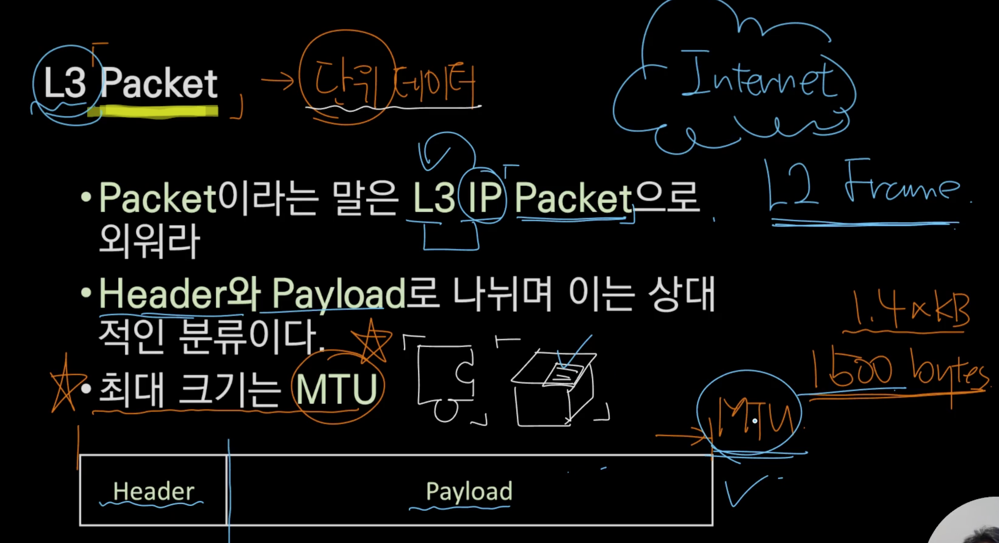
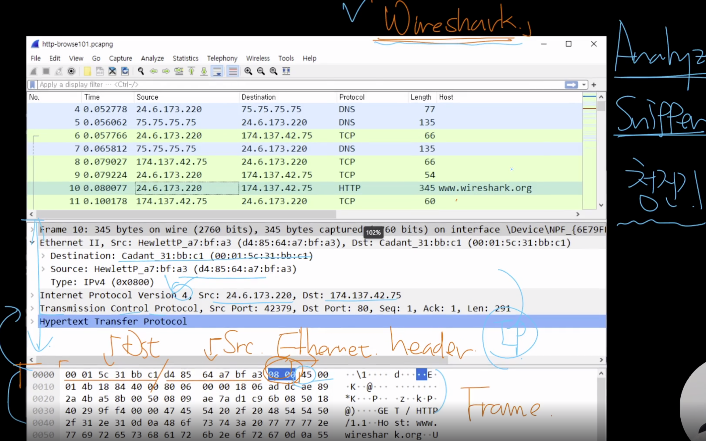
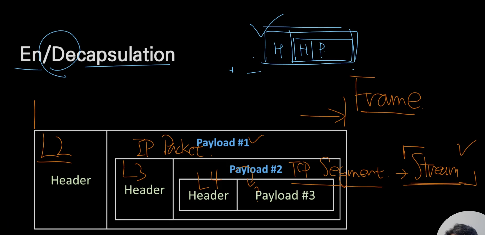
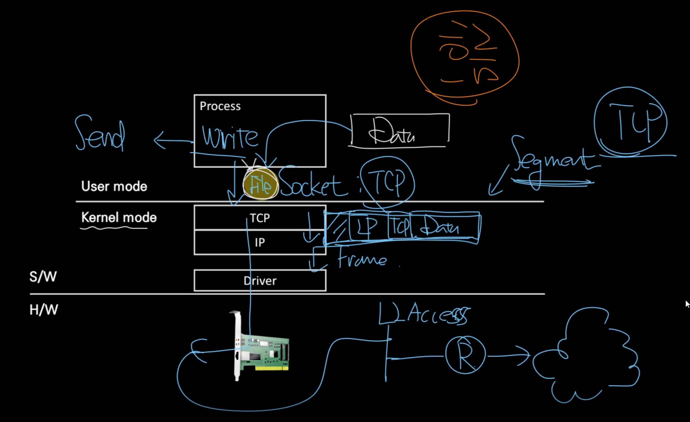
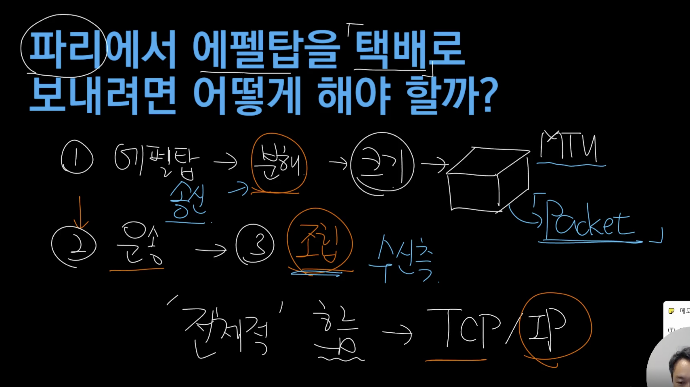

## L3 수준에서 외울 것들 

### IPv4주소의 기본 구조 

  - IPv4 => 32bit = 8bit * 4 
    - 8bit = 0 ~ 255 
    - 1111 1111 -> 브로드캐스트 

- IP => host 
  - 네트워크 ID    
    - 서울시 강남구 역삼동 ~
  - 호스트 ID     
    - 번지
  - 고속도로 + 택배 
    - 택배 - 물류센터 
    - 택배차에 다모아 = 네트워크 ID 
    - 어느 지번으로? = 호스트 ID

### L3 Packet (L3 IP Packet)

- 단위 데이터 
  - 패킷은 하나의 조각하나, 송장붙힌 택배하나
- Header와 Payload로 나뉘며 이는 상대적인 분류 
  - Header = 송장 
    - soruce -> destiation
  - Payload = 택배 내용물
- 최대 크기는 `MTU` (1500bytes)

### Encapsulation 

- 택배 보낼 것을 택배상자에 포장한다 = 캡슐화 
  - 단위화 
  - 내용물이 책인지 음식물인지 모른다.
- L2 Frame = Header + L3 Packet => L2 Header + L3 Header L4 Segment(TCP) 

### 패킷의 생성, 전달, 소멸

- 철수, 영희 = Process 
- 책 = Data 
- 택배 = Packet 
- 집 = Host 
- 현관 = 인터페이스 
- 기사 = Gateway 
- 물류체계 = 라우팅 
- 이름 = 포트 

- 택배가 어떻게 가? = 택배사의 물류체계에 따라 다름
- 송장 = 주소, 이름 (src, dst)
- 택배를 기사님에게 보내면 이후로 보내는 사람은 개입하지 않음
  - 기사가 집에 가는 건 송장보고 감
- 집에 두고가거나 가족이 받을 수 도 있음 
  - 뜯어보진 않음 

### 계층별 데이터 단위
- Socket - Stream = 시작은 있지만 끝은 정확히 정의 X (프로세스 수준에서 정의함)
  - 데이터 무제한? 
  - MTU, MSS(Segment) 보다 크면?
  - 데이터를 `분할`한다 - MSS단위로

### TCP/IP 송,수신 구조

- Buffer - 메모리 공간
  - Process, Socket 등에 있음
- 파일중 일부를 Process Buffer에 복사
  - Process Buffer -> Socket Buffer에도 복사 (전송)
  - 단위는 Stream 
- Socket에서 전송하기 위해 분할 - Segment
  - 번호가 붙게 된다.  
- 트럭이 목적지로 한번에 가지 않는다. 
  - Frame은 보내는 과정(트럭)이 계속 바뀐다.

- 채움과 비움이 동시에 일어난다. - 여유가 있다.
  - Buffer들 끼리
- TCP에서 잘 받았다고 응답한다. - ACK #3(2번까지 잘 왔어~)
  - 여유공간의 크기도 같이 응답!!
- 송신측에서 1,2보내고 기다린다. - ACK #3을 기다림(잘 갔나?)

- 네트워크 - 불안정해서 장애가 잘 발생한다. 
  - Loss (유실)
    - 네트워크 문제
  - ReTransanmission + Ack Duplicate
    - 네트워크 or End-point간의 문제
  - Out of Order - 1 -> 2 -> 4 -> (3)??
    - 네트워크 문제
  - Zero Window 
    - 여유공간 - Window Size 
    - 프로세스쪽에서 빠르게 처리 못해서 Socket Buffer가 꽉참
    - 여유공간이 0이라고 응답
    - End-point 문제
  - OS수준에서 보정을 진행